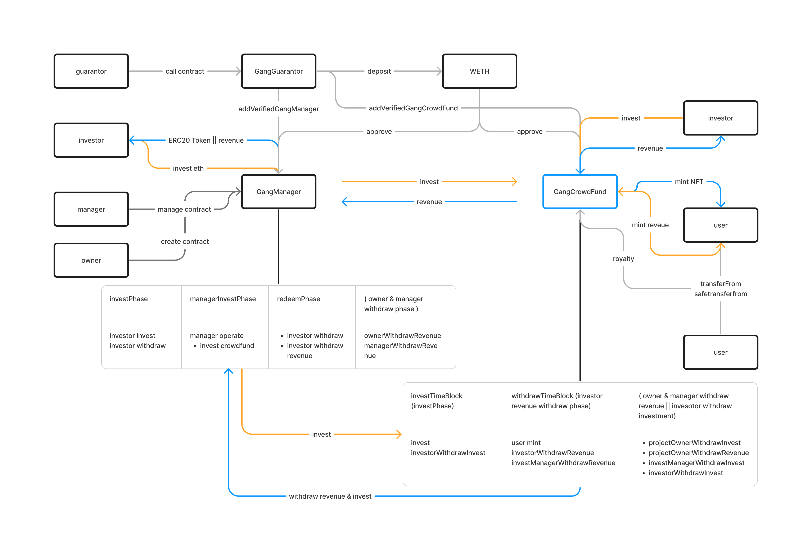

## NFT Manager & CrowdFund

### 角色:
#### Gang Guarantor (基金管理人 & 眾籌 NFT 項目 保證人)
1. 提供 GangCrowdFund & Gang Manager 保證金，若投資項目收益達不到預期目標則啟動保證金機制
2. 若 GangCrowdFund & Gang Manager 項目失敗，保證金將補償給予投資者
3. 賺取 fund manager 的管理費&平台費 

#### Gang CrowdFund (眾籌 NFT 項目)
1. 透過 funding 取得前期資金支援
2. mint 和 transfer 時收取手續費，並將該收益轉交給投資人

#### Gang Manager 基金管理人 (藝術家、KOL)
1. 鑑定 Gang CrowdFund 並提供 fund 資金
2. 用藝術家, KOL 的專業判斷 GangCrowdFund 項目價值
3. 投資多個 GangCrowdFund 項目分散風險
優點:
1. 投資的同時提高 Gang CrowdFund 的價值 (因該項目由基金管理人背書)

#### Gang Manager investor 投資者
投資 Gang Manager
1. 投入資金就可以參與藝術 nft 的創投
2. 分散風險於多個 Gang CrowdFund 項目
3. 由 Gang Guarantor 背書，於投資失敗時可回收部分資金

#### Gang CrowdFund investor 投資者
投資 Gang CrowdFund

### 流程
1. 先建立 GangCrowdFund，開放投資者投資
2. 建立 Gang Manager， 並設定是否只能投資經過 Gang Guarantor 認證過的 GangCrowdFund，之後開放投資者投資基金。
3. Gang Manager 投資 GangCrowdFund，並等待 GangCrowdFund 開放給用戶 mint 與 transfer
4. GangCrowdFund 提取資金用作宣傳，並開放用戶 mint NFT
5. 當 Gang CrowdFund 有 user mint 或 transfer 的時候，Gang Manager 呼叫 GangCrowdFund 收取抽成費用。
6. Gang Manager 將投資於 Gang CrowdFund 的收益收回。
7. Gang Manager 會設定 redeem 時間，當時間到的時候， user 可以將本金贖回加上投資收益 (mint fee & priority fee 抽成)。
8. Gang Manager owner & manager 領取相對應的收益。

#### 架構圖:

架構圖 (Figma 連結) : 
https://www.figma.com/file/4MMYEkrObr2bTrOUsnM0pZ/Untitled?type=whiteboard&node-id=0%3A1&t=tOkFscjOVLI81h46-1

#### 測試覆蓋率

source:
[Introducing ERC721-C: A New Standard for Enforceable On-Chain Programmable Royalties | by Limit Break Dev | Limit Break | Medium](https://medium.com/limit-break/introducing-erc721-c-a-new-standard-for-enforceable-on-chain-programmable-royalties-defaa127410)

[Funded - Crowdfund the future](https://funded.app/)

[2023 List of NFT Funds & Collector DAOs — Collective Shift](https://collectiveshift.io/nft/nft-funds-and-collector-dao-list/)

[party dao](https://github.com/PartyDAO)
