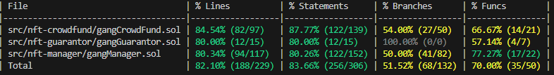

## NFT Manager & CrowdFund
### Description 概述
此專案為去中心化基金管理人，目標是將投資 NFT 的風險降低並提高 NFT 眾籌項目的價值．
- 眾籌 NFT 項目可將不想直接擁有該 NFT 項目( 高風險 ) ，但看好該投資項目的用戶，提供前期投資的機會並獲取未來開賣時抽取得收益
- 基金管理人合約透過集資，分散投資眾籌 NFT 項目，更加降低投資風險，同時由大型基金投資的項目其價值易提高 (由大量資本背書)
- 於上述基礎上建立擔保人機制，提供眾籌 NFT 項目&基金管理人合約保險金，若項目收益達不到設置門檻，會提供投資者部分補償金，加深投資者意願．
---
### 角色
基金管理人 Gang Manager
1. 基金投資者 : 投入 ETH 於管理人合約並取得對應報酬的用戶
2. 基金管理人  : 操作管理人合約，並取得對應報酬的用戶，以下簡稱管理人
3. 基金創建者 ： 創建管理人合約的用戶
--- 
NFT 眾籌項目 Gang Crowdfund
1. NFT 眾籌項目創建者 ： 創建 NFT 眾籌項目用戶
2. NFT 眾籌項目投資者 ： 前期投入 ETH 於 NFT 眾籌項目供項目方使用
3. NFT 眾籌項目買家 ： 透過合約鑄造或轉移 NFT，給予項目方手續費
--- 
項目擔保人 Gang Guarantor
1. 擔保人 ： 認證管理人與NFT 眾籌項目，將其加入擔保人合約，會 Approve WETH 予管理人或眾籌項目當虧損時賠償給投資者的保險金
--- 
#### 角色與其對應功能
- 擔保人合約( gangGuarantor )
	- 擔保人
		- 認證項目 - 將認證過的項目加入合約，並提供用戶查詢．
		- 給予保證金 - 對認證過的項目提供 WETH 保險金
		- 領出收益 - 將擔保項目回收的收益提出
- NFT 眾籌項目 (gangCrowdfund )
	- NFT 眾籌項目投資者
		- 投資項目 - 投入 ETH 供項目方前期使用
		- 領取收益 - 投資者可獲得與其投資比例相應報酬．
		- 贖回本金 -  於贖回階段時，換回存入 ETH．
	- NFT 眾籌項目創建者
		- 更改 NFT 地板價格
		- 更改 NFT 交易手續費
		- 設置 ERC721 Token URI
		- 領出投資者資金 ~~然後烙跑~~
- 管理人合約 ( gangManager)
	- 基金投資者
		- 投資合約 - 將  ETH 存入合約供管理人使用，並換回 ERC20 Token 做投資證明．
		- 取得收益 - 於管理人投資標的時，投資者可獲得與其投資比例相應報酬．
		- 贖回本金  - 於贖回階段時，投資者可憑 ERC20 token 換回存入 ETH．
	- 管理人
		預設僅允許投資認證過 NFT 眾籌項目
		- 投資項目 - 使用投資人資金投資 
		- 取得收益 - 取得 NFT 眾籌項目收益
		- 贖回本金 - 贖回於NFT 眾籌項目本金
	- 基金創建者
		- 取得收益 - 按創建合約時的比例取得對應收益
--- 
### 架構圖 Framwork:
 所有架構圖好讀版 (Figma 連結) : 
https://www.figma.com/file/4MMYEkrObr2bTrOUsnM0pZ/Untitled?type=whiteboard&node-id=0%3A1&t=tOkFscjOVLI81h46-1

#### 所有相關模組

---
#### 流程
1. 先建立 GangCrowdFund，開放投資者投資
2. 建立 Gang Manager， 並設定是否只能投資經過 Gang Guarantor 認證過的 GangCrowdFund，之後開放投資者投資基金。
3. Gang Manager 投資 GangCrowdFund，並等待 GangCrowdFund 開放給用戶 mint 與 transfer
4. GangCrowdFund 提取資金用作宣傳，並開放用戶 mint NFT
5. 當 Gang CrowdFund 有 user mint 或 transfer 的時候，Gang Manager 呼叫 GangCrowdFund 收取抽成費用。
6. Gang Manager 將投資於 Gang CrowdFund 的收益收回。
7. Gang Manager 會設定 redeem 時間，當時間到的時候， user 可以將本金贖回加上投資收益 (mint fee & priority fee 抽成)。
8. Gang Manager owner & manager 領取相對應的收益。
---
#### 擔保人合約( gangGuarantor ) 流程

---
#### NFT 眾籌項目 (gangCrowdfund ) 流程

---
#### NFT 眾籌項目 (gangCrowdfund ) 時間線

---
#### 管理人合約 ( gangManager) 流程

---
#### 管理人合約 ( gangManager) 時間線

---
### 整體 (overview) 

---

### Development
- Contract Local Environment
require sepolia rpc url
see: https://www.alchemy.com/

modify .env.example to .env
```env
SEPOLIA_RPC_URL=[your_sepolia_rpc_url]
ETHERSCAN_API_KEY=[your_etherscan_api_key]
PRIVATE_KEY=[your_private_key]
```

then run
```
forge script script/deployGang.s.sol:deployGangCrowdfund --broadcast --verify --rpc-url $SEPOLIA_RPC_URL
```

#### deployed contract

##### GangGaurantor
[GangGaurantor](https://sepolia.etherscan.io/address/0x5062622c155bea42971f92ee8df8b273c51a125b)
##### GangManager
[GangManager](https://sepolia.etherscan.io/address/0x51cb2823bda6f0068110af5f4e81a67b6f5c1998)
##### GangCrowdFund
[GangCrowdFund](https://sepolia.etherscan.io/address/0xaa08a65a041d97e207a5e344ca3a9069b6238c61)

### How to test
修改 example.env
需改 SEPOLIA_RPC_URL=
之後執行
```sh
forge install
forge test
```
---
#### Testing
test_init() (gas: 12324) 測試初始化一切正常
testMint() (gas: 318270) 測試用戶在 NFT 眾籌可以 Mint
test_CrowdFund_invest_withdraw() (gas: 137247) 測試用戶在 NFT 眾籌可以投資和領出資金
test_crowdfund_mint_transfer_withdraw() (gas: 614164) 測試用戶可以在 Crowdfund
test_guarantor_functions() (gas: 54548) 測試擔保人操作
test_manager_invest_withdraw_crowdfund() (gas: 487638) 測試基金管理人投資 NFT 眾籌
test_manager_whole_process_with_deficit() (gas: 713837) 測試基金管理人完成所有流程負收益時的情況
test_manager_whole_process_with_profit() (gas: 957128) 測試基金管理人完成所有流程正收益時的情況
---
#### 測試覆蓋率



source:
[Introducing ERC721-C: A New Standard for Enforceable On-Chain Programmable Royalties | by Limit Break Dev | Limit Break | Medium](https://medium.com/limit-break/introducing-erc721-c-a-new-standard-for-enforceable-on-chain-programmable-royalties-defaa127410)

[Funded - Crowdfund the future](https://funded.app/)

[2023 List of NFT Funds & Collector DAOs — Collective Shift](https://collectiveshift.io/nft/nft-funds-and-collector-dao-list/)

[party dao](https://github.com/PartyDAO)
